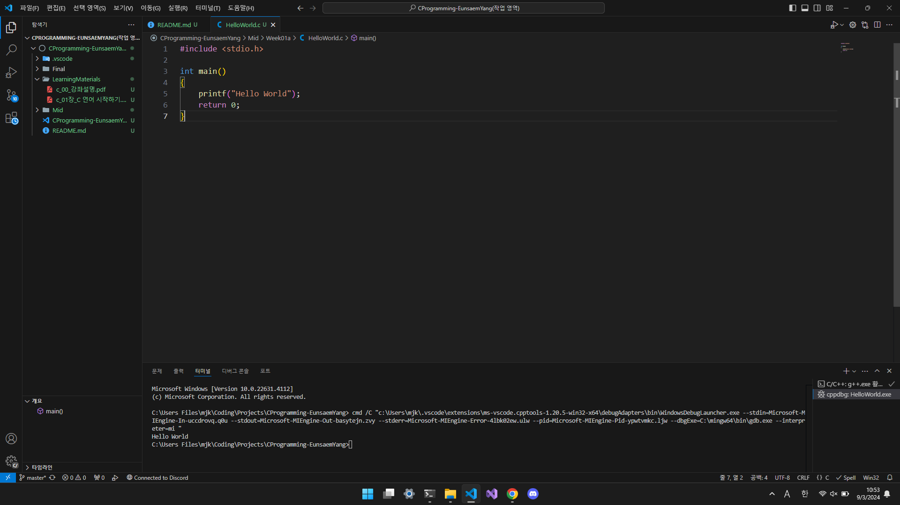

# 💻 CProgramming-EunsaemYang

## Preview

## Introduction

> 2024년 2학기 C프로그래밍[02]

## Evaluation method

> 중간 32%  
> 기말 38%  
> 태도/과제 15%  
> 출결 15%  
>   
> 100점 만점으로 환산했을 경우 **40**점 이하는 F학점  

- 무조건 파일입출력 까지는 진도가 나감. 강의 순서와 구성은 [c_00_강좌설명.pdf](./LearningMaterials/c_00_강좌설명.pdf) 참조
- 실습 -> 과제, 동영상 -> 퀴즈(1주차만 퀴즈 없음)
- 교재 : Untact 시대의 C프로그래밍 | 저자 김대국, 양은샘